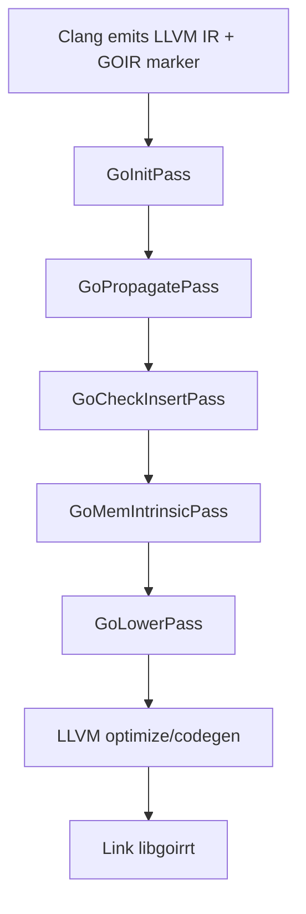

# GOIR Language Documentation Bundle
Date: 2026-04-08 (Europe/London)

## Executive summary

GOIR (Graded-Optic IR) is a research-and-engineering IR layer for retrofitting **memory safety** onto legacy C/C++ code by reinterpreting each pointer as a **graded optic**: a compositional bidirectional accessor into heap state, paired with a **grade** that tracks safety obligations (bounds, lifetime, permissions, provenance, and optionally alias discipline). The goal is not to “reinterpret C” informally, but to provide a **precise, implementable contract** between source-level pointer semantics (including contentious provenance behavior) and concrete enforcement backends (software-only metadata propagation, sanitizer-like diagnostics, and capability hardware). This approach is explicitly motivated by (a) the practical success of compiler-instrumentation runtimes such as AddressSanitizer ([LLVM/Clang ASan docs]), (b) metadata-propagation retrofits like SoftBound and CETS ([SoftBound PLDI’09], [CETS ISMM’10]), and (c) capability-pointer architectures like CHERI ([CHERI TR-947]). Semantic compatibility is constrained by the unsettled state of C pointer provenance; GOIR therefore parameterizes its ptr-int behavior by PNVI-style policies ([Memarian et al., POPL’19], [WG14 N2364]).

This documentation targets three audiences simultaneously:
- **Developers** (using GOIR to diagnose and migrate legacy code),
- **Implementers** (building the compiler passes/runtime),
- **Verifiers** (mechanizing semantics and proving refinement and backend correspondence).

All unspecified deployment assumptions—**target C dialect**, **OS/ABI**, and **hardware**—are explicitly treated as **OPEN-ENDED** and must remain configuration parameters until a deployment target is selected.

## Table of contents

- Language overview and motivation
- Formal specification: syntax, types, grades, instruction set, laws
- Operational semantics and refinement to a C-subset (PNVI-parameterized)
- LLVM lowering and GOIR “call surface” (intrinsics/ABI) with examples
- Compiler pass architecture and implementer guide
- Runtime API, shadow metadata, and trace schema
- Enforcement tiers and migration playbook
- Debugging, diagnostics, evaluation, and verification roadmap
- Tutorials (quickstart, passes, provenance policy, porting)
- Appendices: glossary, OPEN-ENDED assumptions, references

## Language overview and motivation

### GOIR in one sentence

GOIR defines a **graded pointer type** and a set of **grade-aware pointer operations** so that every dereference, update, cast, and bulk memory operation can be interpreted as an **effectful bidirectional optic** over heap state with explicit, composable safety obligations (grades).

### Why “pointer-as-graded-optic”

In C, “pointer” values are overloaded: they serve as raw addresses, convey (implicit) bounds and lifetime assumptions, participate in aliasing constraints, and interact with provenance semantics—especially through pointer–integer conversions. Experience shows that retrofitting safety requires making this implicit metadata explicit and consistently propagated:
- **SoftBound** attaches and propagates base/bounds metadata per pointer to enforce spatial safety ([SoftBound PLDI’09]).
- **CETS** adds temporal metadata (object IDs/epochs) to detect use-after-free under stated assumptions ([CETS ISMM’10]).
- **ASan** inserts runtime checks and uses shadow memory to detect a broad class of memory errors with typical overhead around 2× ([LLVM/Clang ASan docs]).
- **CHERI** replaces raw pointers with capabilities embedding bounds/permissions enforced by hardware ([CHERI TR-947]).

GOIR unifies these as **grades** and makes pointer operations lawful and compositional by design. The “optic” framing provides a disciplined way to specify *what it means* for a pointer to support get/put operations and for those operations to compose; coalgebraic and categorical optics work is the conceptual foundation for lawful bidirectional accessors (e.g., lenses as coalgebras, optics as a general construction) ([Gibbons & Johnson, “Relating Algebraic and Coalgebraic Descriptions of Lenses”], [Riley, “Categories of Optics”]). The grading mechanism is grounded in graded effect/coeffect semantics ([Katsumata POPL’14], [Gaboardi et al. ICFP’16]).

### Design principles

- **Compatibility-first with explicit parameters**: provenance policy is selectable (PNVI variants), and unsupported idioms fall back to conservative grades rather than silently miscompiling ([Memarian et al., POPL’19], [WG14 N2364]).
- **UB-to-trap refinement**: in enforcement tiers, many baseline-UB executions trap deterministically; defined behavior must be preserved (see Semantics section) ([Memarian et al., POPL’19], [CHERI TR-947]).
- **Tiered adoption**: diagnostic (sanitizer-like), hybrid (disjoint metadata propagation), and capability-backed modes (CHERI) to support incremental migration ([LLVM/Clang ASan docs], [SoftBound PLDI’09], [CETS ISMM’10], [CHERI TR-947]).

## Formal specification

### OPEN-ENDED assumptions

The following are explicitly **OPEN-ENDED** configuration parameters and must not be hard-coded:
- Target **C dialect** (C11/C17/C23, GNU extensions, etc.).
- Target **OS/ABI** (ELF/Linux, Windows/MSVC, FreeBSD, etc.).
- Target **hardware** (x86_64, AArch64, CHERI/Morello, etc.).

GOIR specifies semantics relative to a **chosen C-subset** and **chosen provenance policy**; both are parameters.

### Core syntactic categories

GOIR is a typed IR with explicit grade-carrying pointers and heap primitives.

#### Types

Let `τ` range over value types:

- Base types: `i8 | i16 | i32 | i64 | ... | bool`
- Aggregate types: `struct { f1:τ1, ..., fn:τn } | array[n] τ`
- Pointer types:
  - `ptr τ` — raw machine pointer (LLVM-level pointer)
  - `gptr τ` — graded pointer to `τ`

Grades:
- `grade` — a record type (see schema below)

#### Values

- Integers, booleans, aggregates
- `null : ptr τ`
- `gnull : gptr τ` (defined as `(null, g_top)`)

### Grade schema

A GOIR graded pointer value is conceptually:

`gptr τ  ≜  (addr : ptr τ, g : grade)`

The grade is a product of components aligned to known enforcement mechanisms:

| Component | Purpose | Typical backend realization | Notes |
|---|---|---|---|
| `G_bounds` | Spatial safety (within allocation/subobject bounds) | SoftBound-style base/end checks; CHERI bounds | Spatial checking is foundational for temporal checking assumptions ([SoftBound PLDI’09], [CETS ISMM’10]) |
| `G_life` | Temporal safety (allocated vs freed; epoch) | CETS-style alloc_id/epoch | CETS proves temporal safety under stated conditions ([CETS ISMM’10]) |
| `G_perms` | Authorization (read/write/free/exec) | CHERI permissions; software checks | Capability-backed in CHERI ([CHERI TR-947]) |
| `G_prov` | Provenance policy state (PNVI variants) | Runtime exposure sets; conservative “unknown provenance” | Must be policy-parameterized ([Memarian et al., POPL’19], [WG14 N2364]) |
| `G_alias` (optional) | Aliasing/ownership discipline | Optional SB-like tags; or “none” | If enabled, must be defined by a concrete model (often UB-to-trap) |

#### Suggested concrete grade record (logical)

```text
grade ::= {
  bounds: { base:u64, end:u64, kind: BoundsKind },
  life:   { alloc_id:u32, epoch:u32, alive:bool },
  perms:  { r:bool, w:bool, f:bool, x:bool },
  prov:   { policy: ProvPolicy, tag:u32, exposed:bool },
  alias:  { model: AliasModel, token:u64 }   // optional / may be unused
}
```

### Grade algebra

GOIR defines three operations over grades:

- **Refinement order** `≤` (“no less safe; no less informative”)
- **Join** `⊔` (conservative merge for control flow merges)
- **Sequencing** `⊗` (composition along program execution / transformations)

These operations are conceptually grounded in graded effect/coeffect algebraic structure (e.g., monoidal/semiring structure for composition and accumulation) ([Katsumata POPL’14], [Gaboardi et al. ICFP’16]).

#### `≤` (refinement)

Intuition: `g1 ≤ g2` means `g1` is at least as safe and precise as `g2`.

Componentwise examples:
- Bounds: `[b1,e1] ≤ [b2,e2]` iff `[b1,e1] ⊆ [b2,e2]` (tighter bounds refine).
- Life: `(alloc_id,epoch,alive=true)` refines `alive=unknown`.
- Perms: fewer permissions refines more permissions (intersection-style).
- Prov: a specific provenance tag refines unknown/wildcard; policy-specific.
- Alias: a strict token/state refines unknown/no-model.

#### `⊔` (join)

Used at SSA merges (`phi`, `select`) and across uncertain flows.

- Bounds: `join` is conservative—e.g., interval hull or “unknown” if incomparable.
- Perms: intersection is conservative (only keep permissions guaranteed on all paths).
- Life: conservative merge often yields “unknown alive/epoch” unless equal.
- Prov: policy-defined; often yields “unknown provenance” if tags differ.
- Alias: conservative; typically yields unknown unless equal.

#### `⊗` (sequencing/transform composition)

Used to compose grade transformers along pointer operations. Many transforms act as functions `grade → grade`; `⊗` is “apply sequentially” (function composition). In a product-grade implementation, you typically define an instruction-specific transformer `T_op` and then accumulate (by composition) as the program executes. This corresponds to graded-effect composition semantics ([Katsumata POPL’14]).

### Instruction set and typing

GOIR instruction names are written in `g*` style.

#### Allocation and free

- `galloc τ (nbytes : i64) : gptr τ`
  Allocates `nbytes`, returns `(addr, g_init)`.

- `gfree (p : gptr τ) : unit`
  Valid only if `perms.f` and `life.alive` (and policy constraints); otherwise trap in enforcement tiers.

#### Load/store

- `gload τ (p : gptr τ) : τ`
  Checks at least: `bounds`, `life`, `perms.r`, and policy constraints.

- `gstore τ (p : gptr τ) (v : τ) : unit`
  Checks at least: `bounds`, `life`, `perms.w`.

#### Pointer arithmetic

- `ggep (p : gptr τ) (offset : i64) (scale : i64) : gptr τ`
  Represents `addr + offset*scale`. Updates bounds/prov/alias per transfer rules.

#### Pointer–integer casts

- `gptrtoint (p : gptr τ) : i64`
  May trigger provenance “exposure” effects depending on PNVI policy ([WG14 N2364]).

- `ginttoptr τ (i : i64) : gptr τ`
  Resolves provenance per policy; may return “unknown provenance” grade.

#### Bulk memory

- `gmemcpy (dst : gptr i8) (src : gptr i8) (len : i64) (layout : LayoutKind) : unit`
  `layout` indicates whether pointer layout is known (typed) vs unknown (taint) vs pointer-free.

### Law templates (normative)

Law templates define what implementations must uphold. They are “graded” because they hold under validity conditions encoded by the grade.

#### Graded GetPut / PutGet / PutPut

Let `get_p` and `put_p` be the semantic actions of `gload` and `gstore` at a location focused by `p`.

- **Graded GetPut**: If `gload(p)` succeeds producing `v`, then `gstore(p,v)` must not change the observable heap at that location (modulo shadow metadata), unless policy allows divergence; otherwise trap.
- **Graded PutGet**: If `gstore(p,v)` succeeds and no intervening action invalidates constraints (e.g., `free`), then `gload(p)` returns `v`.
- **Graded PutPut**: Two successive successful stores to the same focus leave the last stored value in the focused location.

These reflect classic lens round-trip laws, adapted to effectful heap operations and explicit failure/trap outcomes (optic lawfulness inspiration: [Gibbons & Johnson], [Riley]).

#### Monotonicity (no forging)

No program step may transform a grade to a strictly less restrictive/more authoritative grade unless the semantics grants such authority. This is analogous to capability monotonicity constraints in CHERI, where deriving a capability cannot increase authority beyond the source ([CHERI TR-947]).

#### Compositionality

Grade transformers must compose: the grade of a derived pointer (e.g., via `ggep`) must be a function of the source grade and the transformation, and must merge conservatively at control-flow joins (`⊔`). This aligns with effect-system semantics based on graded monads/coeffects ([Katsumata POPL’14], [Gaboardi et al. ICFP’16]).

## Operational semantics and refinement to a C-subset

### Operational semantics summary

A GOIR execution state is:

`⟨ H, Σ, e ⟩`

- `H`: heap mapping allocations to byte arrays and allocation metadata (size, live/dead, etc.)
- `Σ`: shadow metadata state (mapping memory locations holding pointers to grade records; plus object tables)
- `e`: expression/command to execute

Key rule pattern (load):

- If `check_load(p, g, size, H, Σ)` holds, load succeeds and returns value.
- Otherwise, behavior depends on tier:
  - **diag/hybrid/cap**: trap with a taxonomy code (bounds/life/perms/prov/alias/unknown).
  - **baseline C semantics**: may be UB; GOIR uses refinement (below).

### Refinement relation to a chosen C-subset (parameterized PNVI)

We define correctness as **UB-to-trap refinement** w.r.t. a chosen C-subset semantics with a provenance policy selected from PNVI variants (e.g., PNVI-plain, PNVI-ae-udi) ([Memarian et al., POPL’19], [WG14 N2364]).

Let `⟦P⟧_C` be the baseline evaluation of program `P` under the chosen C-subset + PNVI policy. Let `⟦compile(P)⟧_GOIR` be GOIR evaluation.

Refinement requirement:
- If `⟦P⟧_C` is **defined** and produces observable result `O`, then `⟦compile(P)⟧_GOIR` must produce `O`.
- If `⟦P⟧_C` is **undefined (UB)**, then `⟦compile(P)⟧_GOIR` may trap (and should do so in enforcement tiers) without violating refinement.

This stance mirrors how CHERI-style systems often turn dangerous undefined behaviors into deterministic faults ([CHERI TR-947]) and aligns with the provenance-focused emphasis that semantics-preserving lifts must choose a policy stance ([Memarian et al., POPL’19]).

## LLVM lowering and GOIR “call surface” (intrinsics / ABI)

### Goals of lowering

- Represent `gptr` and `grade` in a way implementable in LLVM/Clang.
- Support three tiers with a single IR strategy (extra checks and metadata can be enabled/disabled).
- Preserve compatibility at ABI boundaries via disjoint metadata in hybrid mode and capability pointers in cap mode ([SoftBound PLDI’09], [CETS ISMM’10], [CHERI TR-947]).

### Two lowering styles (choose one for MVP; support both long-term)

#### Style 1: Intrinsics (“llvm.go.*”)

Pros: analyzable by LLVM passes; stable semantics in IR.
Cons: requires defining/maintaining intrinsics; may complicate upstreaming.

Examples:
- `@llvm.go.grade_from_alloca(ptr, i64 size) -> %go.grade`
- `@llvm.go.gep_grade(%go.grade, i64 offset, i64 scale) -> %go.grade`
- `@llvm.go.join_grade(%go.grade, %go.grade) -> %go.grade`
- `@llvm.go.check_load(ptr, %go.grade, i64 size)`
- `@llvm.go.prov_expose(ptr, %go.grade)`
- `@llvm.go.inttoptr_resolve(i64, i32 prov_policy) -> {ptr, %go.grade}`

#### Style 2: Stable runtime call ABI (“__go_*”)

Pros: portable; no LLVM intrinsic work required.
Cons: less analyzable; harder to optimize/elide checks without special knowledge.

### LLVM representation of `gptr`

Logical:
- `gptr<T> = (ptr<T>, grade)`

LLVM SSA representation:
- either an SSA struct `{ ptr, %go.grade }`
- or two parallel SSA values (`%p` and `%g_p`) managed by passes

### Example lowerings (before/after IR snippets)

All snippets are illustrative; actual names/types are per your implementation.

#### Allocation (stack alloca)

**Before (LLVM IR):**
```llvm
%p = alloca i32, align 4
```

**After (GOIR-lifted, intrinsic style):**
```llvm
%p = alloca i32, align 4
%g_p = call %go.grade @llvm.go.grade_from_alloca(ptr %p, i64 4)
```

#### Allocation (heap malloc)

**Before:**
```llvm
%p = call ptr @malloc(i64 %n)
```

**After (runtime ABI style):**
```llvm
%g_out = alloca %go.grade, align 8
%p = call ptr @__go_malloc(i64 %n, ptr %g_out)
%g_p = load %go.grade, ptr %g_out
```

This mirrors metadata-carrying allocation wrappers typical of retrofits ([SoftBound PLDI’09], [CETS ISMM’10]).

#### Pointer arithmetic (GEP)

**Before:**
```llvm
%q = getelementptr i32, ptr %p, i64 %i
```

**After:**
```llvm
%q = getelementptr i32, ptr %p, i64 %i
%g_q = call %go.grade @llvm.go.gep_grade(%go.grade %g_p, i64 %i, i64 4)
```

#### Load/store with checks

**Before:**
```llvm
%v = load i32, ptr %q
store i32 %v, ptr %q
```

**After:**
```llvm
call void @llvm.go.check_load(ptr %q, %go.grade %g_q, i64 4)
%v = load i32, ptr %q
call void @llvm.go.check_store(ptr %q, %go.grade %g_q, i64 4)
store i32 %v, ptr %q
```

ASan follows a similar “instrument before access” approach, though with different metadata semantics ([LLVM/Clang ASan docs]).

#### ptrtoint / inttoptr

LLVM specifies `ptrtoint` and `inttoptr` in the LangRef, but their precise provenance implications are a known semantic pressure point; GOIR therefore makes provenance policy explicit ([LLVM LangRef], [Memarian et al., POPL’19], [WG14 N2364]).

**Before:**
```llvm
%i = ptrtoint ptr %p to i64
%q = inttoptr i64 %i to ptr
```

**After (PNVI-exposure style):**
```llvm
call void @llvm.go.prov_expose(ptr %p, %go.grade %g_p)
%i = ptrtoint ptr %p to i64
%q = inttoptr i64 %i to ptr
%g_q = call %go.grade @llvm.go.inttoptr_grade(i64 %i, i32 %prov_policy)
```

#### memcpy

LLVM defines `llvm.memcpy.*` intrinsics ([LLVM LangRef]). GOIR rewrites them to grade-aware operations.

**Before:**
```llvm
call void @llvm.memcpy.p0.p0.i64(ptr %dst, ptr %src, i64 %n, i1 false)
```

**After (runtime ABI style):**
```llvm
call void @__go_memcpy(ptr %dst, %go.grade %g_dst, ptr %src, %go.grade %g_src, i64 %n, i32 %layout_kind)
```

Layout policy:
- `layout_kind=POINTER_FREE`: bytes-only
- `layout_kind=TYPED_PTR_LAYOUT`: copy pointer-field metadata
- `layout_kind=UNKNOWN`: taint destination; pointer loads become TOP-grade (conservative)

This echoes the central challenge of preserving pointer metadata through bulk copies in metadata-propagation systems ([SoftBound PLDI’09], [CETS ISMM’10]).

## Compiler pass architecture and implementer guide

### Pass pipeline overview

GOIR is implemented as a set of LLVM passes plus runtime library.

Mermaid pipeline diagram:



### Pass responsibilities (table)

| Pass | Purpose | Inputs | Outputs | Key invariants |
|---|---|---|---|---|
| GoInit | Initialize grades at allocation sites | allocas/globals/allocator calls | grade SSA values | monotonic init; correct object bounds/life |
| GoPropagate | Propagate grades through pointer ops | grade SSA map | new grade SSA at derived pointers | transfer functions; conservative joins (`⊔`) |
| GoCheckInsert | Insert checks on memory ops | loads/stores/free/mem ops | check calls/intrinsics | checks cover all derefs; missing grades → TOP |
| GoMemIntrinsic | Rewrite memcpy/memmove/memset | mem intrinsics | grade-aware calls; tainting | metadata integrity; typed/untyped policy |
| GoLower | Lower to runtime/hardware | go.* intrinsics/calls | runtime calls or CHERI ops | avoid check elision unless sound |

### Pass ordering (normative)

1. **GoInitPass** (must run early; creates base grades)
2. **GoPropagatePass** (must see GoInit outputs)
3. **GoCheckInsertPass** (must see final grade SSA)
4. **GoMemIntrinsicPass** (before final lowering so it can insert checks/taints)
5. **GoLowerPass** (tier-dependent lowering / optional check elision)

### Implementing passes: conventions

- Maintain a function-local mapping `Value* ptrSSA → Value* gradeSSA`.
- For unknown or unsupported transformations, default to **TOP grade** and emit an LLVM remark. Conservative degradation is essential for compatibility with evolving LLVM semantics and provenance ambiguity ([LLVM LangRef], [Memarian et al., POPL’19]).
- Do not rely on debug metadata for correctness; use it only to improve typed memcpy precision where available.

### Intrinsic definitions: TableGen vs calls

If using intrinsics, define them via LLVM’s intrinsic mechanisms (TableGen) and provide stable signatures and versioning. If using ABI calls, centralize the interface in a single header (e.g., `goirrt.h`) and treat it as the stable contract between compiler and runtime.

### Sample command lines

**Compile to LLVM IR (debug-friendly):**
```bash
clang -O0 -g -S -emit-llvm -fgraded-optics=diag t.c -o t.ll
```

**Run GOIR pass pipeline (out-of-tree plugin):**
```bash
opt -load-pass-plugin=libGOIRPasses.so \
  -passes=go-init,go-propagate,go-check-insert,go-mem,go-lower \
  -S t.ll -o t.goir.ll
```

**Check instrumentation (FileCheck):**
```bash
FileCheck t.ll < t.goir.ll
```

## Runtime API, shadow metadata, and trace schema

### Runtime architecture

GOIR runtime provides:
- **Checks**: load/store/free/memcpy validation
- **Shadow metadata**: disjoint metadata for pointers stored in memory (hybrid tier)
- **Allocation tracking**: alloc_id/epoch (temporal safety)
- **Tracing/metrics**: JSONL logs and counters

This closely follows patterns seen in sanitizer runtimes and disjoint metadata retrofits ([LLVM/Clang ASan docs], [SoftBound PLDI’09], [CETS ISMM’10]).

### C header sketch (implementer-facing)

```c
// goirrt.h (sketch)
#include <stdint.h>
#include <stddef.h>
#include <stdbool.h>

typedef struct {
  uint64_t base, end;
  uint32_t alloc_id, epoch;
  uint32_t perms;      // bitmask: R=1,W=2,F=4,X=8
  uint32_t prov_tag;   // policy-defined
  uint64_t alias_tok;  // optional
  uint32_t flags;      // includes version, bounds-kind, exposed
} go_grade_t;

// Allocation wrappers (optional interceptors)
void* __go_malloc(size_t n, go_grade_t* out_g);
void  __go_free(void* p, go_grade_t g);
void* __go_realloc(void* p, size_t n, go_grade_t* out_g);

// Checks
void __go_check_load(const void* p, go_grade_t g, size_t n);
void __go_check_store(void* p, go_grade_t g, size_t n);
void __go_check_free(void* p, go_grade_t g);

// Shadow metadata (hybrid)
void __go_shadow_store(void* slot_addr, go_grade_t g);
go_grade_t __go_shadow_load(void* slot_addr);

// memcpy policy
void __go_memcpy(void* dst, go_grade_t gdst, const void* src, go_grade_t gsrc,
                 size_t n, uint32_t layout_kind);

// Tracing/metrics
void __go_trace_event(const char* json_line);
void __go_metrics_dump(const char* path);
```

### Shadow metadata format (hybrid tier)

- Shadow maps **addresses of memory slots that hold pointers** to `go_grade_t`.
- The mapping must preserve C memory layout compatibility by being disjoint from program memory ([SoftBound PLDI’09], [CETS ISMM’10]).

### JSON trace schema (developer-facing)

Each event is one JSON object per line (JSONL). Required fields:

```json
{
  "ts": 1712530000,
  "tier": "diag|hybrid|cap",
  "policy": {"prov": "pnvi-plain|pnvi-ae-udi", "alias": "none|sb-like"},
  "event": "init|check_fail|prov_expose|inttoptr_resolve|memcpy_taint",
  "site": {"file": "t.c", "line": 42, "fn": "foo", "llvm": "%12"},
  "ptr": "0x7f12abcd...",
  "grade": {"base":"0x..","end":"0x..","alloc_id":1,"epoch":3,"perms":"RW","prov_tag":7,"flags":123},
  "fail": {"component":"bounds|life|perms|prov|alias|unknown", "detail":"..."}
}
```

## Enforcement tiers and migration playbook

### Tiers

| Tier | Primary goal | Mechanism | Typical use | Trade-offs |
|---|---|---|---|---|
| **diag** | Find bugs quickly | Instrument checks + traces (ASan-like) | CI, fuzzing, debugging | Higher overhead; best for diagnosis ([LLVM/Clang ASan docs]) |
| **hybrid** | Stronger guarantees with acceptable overhead | Disjoint metadata propagation (bounds + lifetime + provenance policy) | Staged production adoption | Complexity in memcpy/layout handling; policy choices matter ([SoftBound PLDI’09], [CETS ISMM’10], [WG14 N2364]) |
| **cap** | Hardware-backed bounds/perms | CHERI capability lowering + residual checks | Capability targets | ABI constraints; must handle interop carefully ([CHERI TR-947]) |

### Migration playbook (normative steps)

1. **Start in diag tier** on unit/integration tests; fix issues and label expected traps.
2. Move modules to **hybrid tier** once major bug classes are addressed; enable shadow metadata.
3. Select provenance policy:
   - More permissive policy for legacy pointer-int heavy code,
   - More conservative policy for stronger optimizer alignment ([WG14 N2364], [Memarian et al., POPL’19]).
4. For capability targets, migrate to **cap tier**:
   - Start in hybrid ABI mode where available,
   - Add ABI shims or whole-program builds as needed ([CHERI TR-947]).

## Debugging, diagnostics, evaluation, and verification roadmap

### Debugging and interpreting traps

A GOIR trap must always report:
- component cause: `bounds | life | perms | prov | alias | unknown`
- site location
- tier and policy settings
- pointer and grade snapshot

Recommended workflow:
1. Re-run with traces enabled.
2. Use a trace CLI to filter by `site` and `component`.
3. If trap is policy-dependent (often provenance), rerun under alternative policy to classify as “compatibility requirement” vs “bug to fix” ([WG14 N2364], [Memarian et al., POPL’19]).

### Evaluation plan

Bench suites (in priority order):
1. **microc**: curated deterministic tests for edge cases (always available).
2. **Juliet**: vulnerability test suite (when available).
3. **SPEC CPU**: performance/compatibility macrobenchmark (license-dependent; treat as optional plug-in).

Metrics:
- runtime slowdown
- memory overhead (shadow tables, metadata)
- % loads/stores guarded
- trap counts by component
- rate of TOP-grade introduction (precision loss indicator)

### Verification roadmap and proof obligations

Recommended proof milestones:
1. **Core calculus mechanization** with explicit traps.
2. **Grade algebra lemmas** (join conservativity, monotonicity, composition laws) grounded in graded effect reasoning ([Katsumata POPL’14], [Gaboardi et al. ICFP’16]).
3. **Refinement theorem skeleton**: C-subset → GOIR UB-to-trap refinement, parameterized by PNVI policy ([Memarian et al., POPL’19], [WG14 N2364]).
4. **Backend correspondence**:
   - hybrid shadow runtime implements abstract checks (SoftBound/CETS style) ([SoftBound PLDI’09], [CETS ISMM’10])
   - capability lowering respects monotonicity constraints (CHERI) ([CHERI TR-947])

## Tutorials (developer/implementer/verifier)

### Quickstart: build and run microc (diag tier)

**Assumptions:** toolchain versions OPEN-ENDED; example commands use placeholders.

1. Build runtime + pass plugin:
```bash
cmake -S . -B build -G Ninja
ninja -C build
```

2. Compile a micro test to LLVM IR:
```bash
clang -O0 -g -S -emit-llvm -fgraded-optics=diag tests/microc/oob_1.c -o oob_1.ll
```

3. Run pass pipeline:
```bash
opt -load-pass-plugin=build/libGOIRPasses.so \
  -passes=go-init,go-propagate,go-check-insert,go-mem,go-lower \
  -S oob_1.ll -o oob_1.goir.ll
```

4. Build and run:
```bash
clang oob_1.goir.ll -Lbuild/runtime -lgoirrt -o oob_1
./oob_1
```

Expected: a deterministic trap with a `bounds` cause on OOB tests.

### Tutorial: writing a new pass

Checklist:
- Declare pass in PassBuilder plugin.
- Preserve analyses correctly; invalidate conservatively.
- Add a lit test showing before/after IR.
- Add a microc regression if it fixes a real bug.

### Tutorial: adding a provenance policy

1. Define policy enum and document in `/docs/policies/provenance.md` referencing PNVI modes ([WG14 N2364]).
2. Implement runtime exposure tracking + inttoptr resolution behavior.
3. Add at least 5 policy-differentiating tests (ptr-int roundtrip patterns) and expected outcomes.
4. Update trace schema to log exposure and resolution events.

### Tutorial: porting a small C project

1. Start with diag tier in CI; fix crashes or classify expected traps.
2. Move to hybrid tier; enable shadow metadata.
3. Identify “unsafe islands” (inline asm, MMIO) and apply conservative annotations (TOP grade boundaries).
4. Measure performance and check counts; optimize only after correctness stabilizes.

## Appendices

### Glossary (selected)

- **Grade**: structured metadata describing safety obligations for a pointer.
- **TOP grade**: conservative “unknown” grade; correctness-preserving but may increase traps/overhead.
- **UB-to-trap refinement**: a correctness relation allowing traps on source-UB executions.
- **Disjoint metadata**: pointer metadata stored separately from program memory to preserve layout compatibility ([SoftBound PLDI’09], [CETS ISMM’10]).
- **PNVI**: provenance-not-via-integer policy family discussed in standards and research ([WG14 N2364], [Memarian et al., POPL’19]).
- **Capability pointer**: pointer carrying bounds/permissions enforced by hardware (CHERI) ([CHERI TR-947]).

### OPEN-ENDED assumptions (explicit list)

- Target C dialect: **OPEN-ENDED**
- Target OS/ABI: **OPEN-ENDED**
- Target hardware: **OPEN-ENDED**
- Concurrency model: **OPEN-ENDED** (stage after MVP)
- Inline asm / volatile semantics: **OPEN-ENDED** (handled as “unsafe islands” initially)

### References (primary/official sources to consult)

- LLVM Language Reference Manual (**LLVM LangRef**)
- Clang/LLVM AddressSanitizer documentation (**LLVM/Clang ASan docs**)
- CHERI C/C++ Programming Guide, UCAM-CL-TR-947 (**CHERI TR-947**)
- SoftBound: “SoftBound: Highly Compatible and Complete Spatial Memory Safety for C” (**SoftBound PLDI’09**)
- CETS: “CETS: Compiler Enforced Temporal Safety for C” (**CETS ISMM’10**)
- Memarian et al.: “Exploring C Semantics and Pointer Provenance” (**Memarian et al., POPL’19**)
- WG14 N2364: PNVI provenance notes (**WG14 N2364**)
- Katsumata: “Parametric Effect Monads and Semantics of Effect Systems” (**Katsumata POPL’14**)
- Gaboardi et al.: “Combining Effects and Coeffects via Grading” (**Gaboardi et al. ICFP’16**)
- (Optics foundations) Gibbons & Johnson; Riley (**coalgebraic lenses / optics lawfulness**)